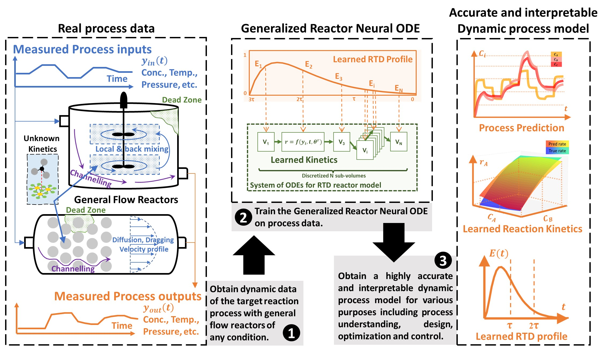

# GRxnODE

A demo for GRxnODE is provided at [demo.ipynb](demo.ipynb)

Generalized reactor neural ODE (GRxnODE) has high model accuracy, physical interpretability, and data efficiency for dynamic reactor modeling. The single model applies to most types of flow reactors with various nonideal mixing characteristics and provides an accurate and efficient solution for a wide range of lab-scale or industry-scale dynamic process modeling problems. Its architecture is inspired by the conventional residence time distribution (RTD) model for modeling real-world unideal chemical reactors. The governing PDE equations of the residence time distribution model and neural ODE are integrated into the framework by discretizing in length dimension. It also allows users to incorporate known knowledge and information on reactor mixing conditions and reaction kinetics into the model. Trained on dynamic input and output data of a reactor process, the model can predict dynamic reactor behaviors accurately and yield useful information such as reaction rate function and RTD with no prior knowledge of the process. Subsequently, a well-trained model can be used for knowledge extraction, reactor design, performance prediction, operations control, and process optimization. 

Link to the article [here](https://www.sciencedirect.com/science/article/pii/S138589472204966X)
